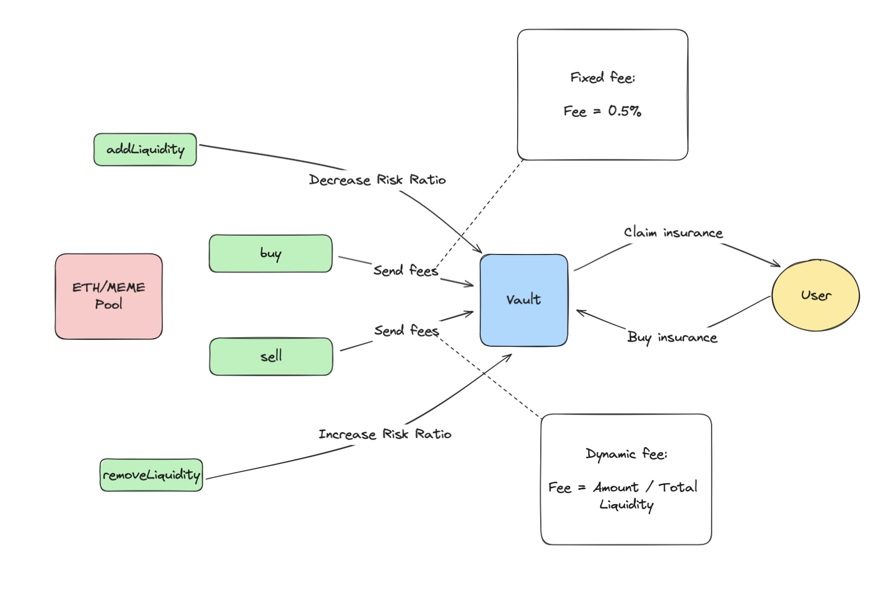

# ETH Global Brussels | Cushion

Cushion is a memecoin launchpad with built-in insurance mechanisms to protect investors, prevent fraud, and provide seamless and secure access to memecoin launches.

- `/app` - Contains the frontend code. (Next.js, WalletConnect, Wagmi, ShadCN, TailwindCSS)
- `/contracts` - Contains smart contracts (Launchapd Vault and Uniswap Hook) made with Foundry.

## Description

Cushion is an innovative memecoin launchpad designed to revolutionize the way investors engage with new memecoin projects. It integrates comprehensive insurance mechanisms to protect investors from fraudulent activities and to provide a secure and seamless experience for launching and accessing memecoins.

Key Features:

- Memecoin Launchpad: Cushion provides a platform for launching new memecoins, ensuring that projects have the support and visibility they need to succeed.

-Built-in Insurance: To protect investors, Cushion offers insurance coverage against the risks associated with memecoin investments, such as rug pulls and fraudulent token deployers.

-Fraud Prevention: Cushion incorporates advanced mechanisms to prevent fraudulent activities. By leveraging World ID, a robust identity verification system, Cushion ensures that both token launchers and investors are verified, reducing the risk of malicious actors.

-Automatic Claims Processing: In the event of a fraudulent incident, Cushion’s smart contracts automatically process insurance claims, ensuring investors are compensated quickly and fairly.

- Dynamic Fee Structure: The platform features a dynamic fee structure, ensuring that insurance costs are proportionate to the amount invested and the total liquidity.

How It Works:

- Launch and Liquidity Management: Project creators can launch their memecoins on Cushion, with the platform handling the technical and promotional aspects of the launch.
  -Users add liquidity to the memecoin pool, which is managed by Cushion to maintain stability and minimize risk.

-Insurance Mechanism:
-When investors swap memecoins, a portion of the transaction fee is contributed to the insurance pool. This insurance pool covers potential losses from fraudulent activities or extreme volatility.

- In case of an insured event, such as a rug pull, the smart contracts automatically trigger compensation to the insured investors.

- Identity Verification:
- To prevent malicious actors from exploiting the system, Cushion uses World ID for identity verification. This ensures that only verified individuals can launch tokens and make insurance claims, mitigating the risk of fraudulent behavior.
